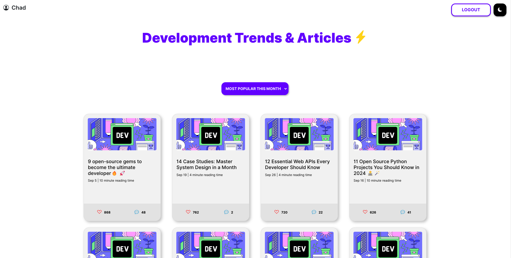

<!-- PROJECT LOGO -->

  

  ### Dev Trends

  

    Trends today, skills tomorrow.
     
     
    <a href="https://github.com/ChadProbert/dev-trends/issues">Report Bug</a>
    ·
    <a href="https://github.com/ChadProbert/dev-trends/pulls">Request Feature</a>
  

  <!-- SHIELDS.IO -->
  
  
  
  
  

  #### Built With

  
  
  
  

 

<!-- TABLE OF CONTENTS -->

  
Table of Contents

  <ol>
    <li>
      <a href="#getting-started">Getting Started</a>
      <ul>
        <li><a href="#setup-your-virtual-environment">Setup your Virtual Environment</a></li>
        <li><a href="#installing-dependencies">Installing Dependencies</a></li>
        <li><a href="#running-dev-trends">Running Dev Trends</a></li>
      </ul>
    </li>
    <li><a href="#sphinx-documentation">Sphinx Documentation</a></li>
    <li><a href="#contributors">Contributors</a></li>
  </ol>

 

## Getting Started

To get a local copy up and running follow these steps.

 

### Setup Your Virtual Environment
Install **[VirtualEnv](https://virtualenv.pypa.io/)** globally

    pip3 install virtualenv

Navigate to the root directory

    cd dev-trends

Activate virtual environment

    source venv/bin/activate

 

### Installing Dependencies
**Once the virtual environment is setup**, install project dependencies using:

    pip3 install -r requirements.txt

 

### Running Dev Trends

Start the development server using:

    python3 manage.py runserver

 

The application should now be running at **http://127.0.0.1:8000/**.

 

## Running With Docker

To run the application with Docker, run the following commands in the terminal:

    
    sudo docker pull chadcprobert/my-website

then
    
    sudo docker run -p 8000:8000 my-website

 

## Sphinx Documentation
To view the documentation generated using **[Sphinx](https://www.sphinx-doc.org/en/master/)**, navigate to the `docs/_build/html` folder and open `index.html` in your browser.

 

## Contributors

 
 
 

<a href="#readme-top">(back to top)</a>

